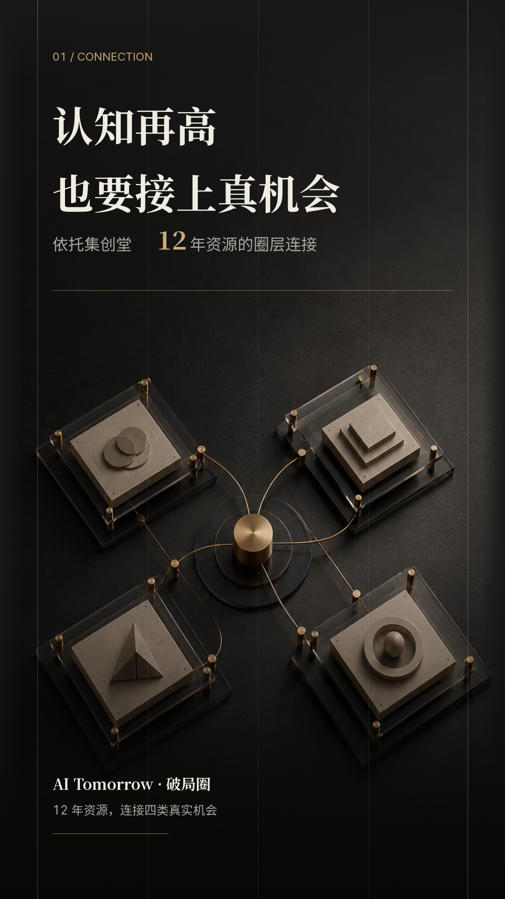
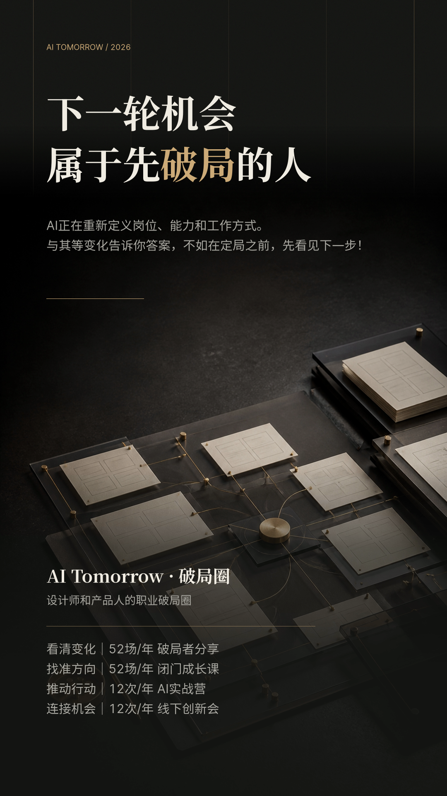
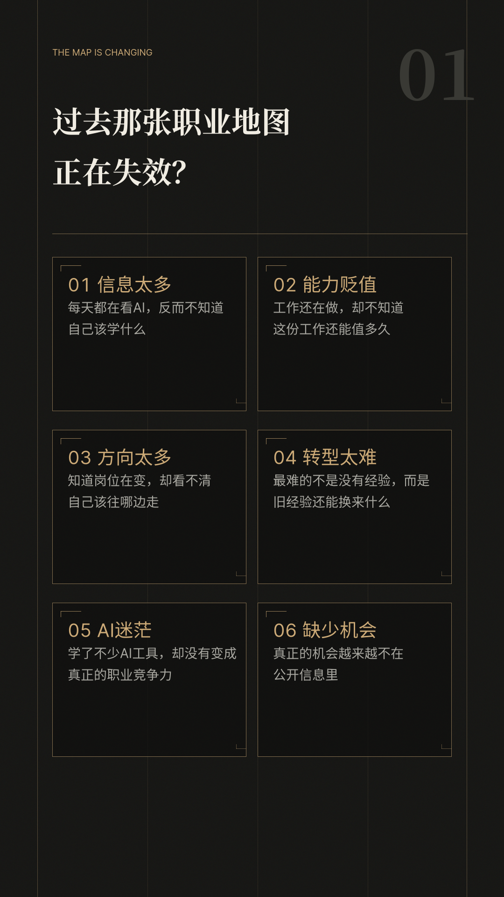
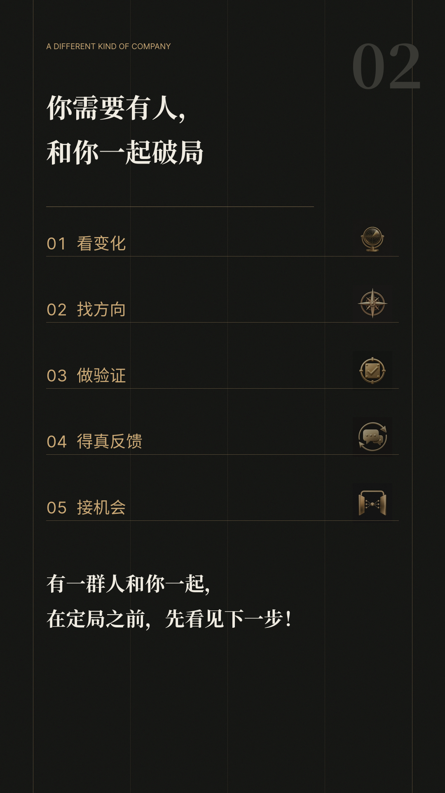
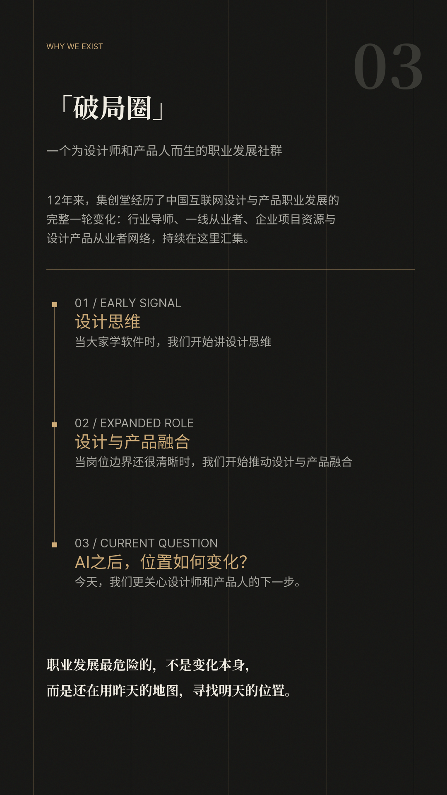

# Yinxi Black Gold Longform

面向课程、活动、研究、权益与专业内容的中文黑金手机长图 Skill。它将冻结文案、真实素材与行动信息组织成一张连续阅读的 1080px 宽长图，并以精确后置文字、连续母版和可检查的版式规则保证移动端可读性。

<p align="center">
  
</p>

## 案例

<p align="center">
  
  
  
  
</p>

## 适合什么

- 课程介绍、线下活动、训练营与权益说明
- 研究、职业发展、专业服务与内容型宣传海报
- 已有完整中文文案、真实人物照片、二维码或品牌素材的移动端长图

不用于多主题视觉探索、纯网页交付，或需要由图像模型生成准确中文信息的任务。

## 它会做什么

- 先冻结文案并创建 `plan.md`，再决定叙事配方和每个阅读区的版式契约
- 使用一张连续炭黑母版，输出 1080px 最终 PNG 与 360px 手机预览
- 首帧必有与标题对象、关系或变化相关的 ImageGen 语义主视觉
- 所有标题、正文、数字、价格、时间、二维码说明均以后置精确文字完成
- 对主视觉位置、卡片文本溢出、单字孤行、人物裁切与二维码行动区进行生产前和导出后检查
- SVG / HTML 只作为内部连续母版源；最终 PNG 必须由同一浏览器布局引擎直接导出

## 安装

在本机终端执行：

```bash
git clone https://github.com/lifafa0616/yinxi-black-gold-longform.git \
  ~/.codex/skills/yinxi-black-gold-longform
```

安装后新开一个 Codex 会话，提供文案与可用素材，并说明“使用 `yinxi-black-gold-longform` 生成长图”。

## 常规交付

- `plan.md`：内容、资产、版式与验收记录
- 1080px 宽最终 PNG 长图
- 360px 宽缩略预览

`frames/` 如出现，仅是从最终 PNG 裁出的诊断图，不是独立生成或拼接的画面；SVG / HTML 也是内部源文件，不属于对外成品。

## 质量底线

- 不删减或改写用户冻结文案
- 连续背景不能出现跨阅读区接缝
- 主标题至少 110px；正文、价格、行动文字至少 36px
- 不允许卡片文字溢出或单字 / 单字符孤行
- 真实人像优先安全抠图透明融入；失败才使用合理原图裁切
- 主视觉、真人、二维码与文字各自使用合适的生产路径，不用 ImageGen 伪造真实身份、准确文字或二维码

## 目录

```text
SKILL.md              # 入口与日常生产关口
references/           # 主题、内容、版式、字体和验收规则
scripts/              # Layout Manifest 与完整性校验器
assets/baseline/      # 批准的视觉基线
examples/             # README 展示案例
```

案例图仅用于说明本 Skill 的视觉基线与版式能力；请勿将其中的原始文案、人物或品牌信息视为新项目素材。
