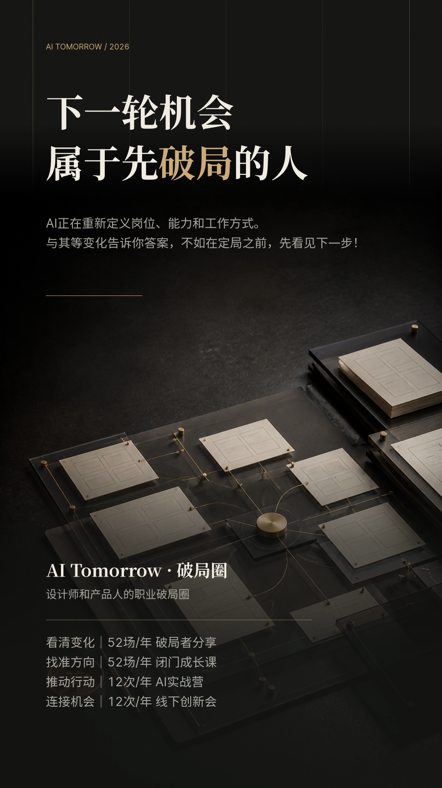
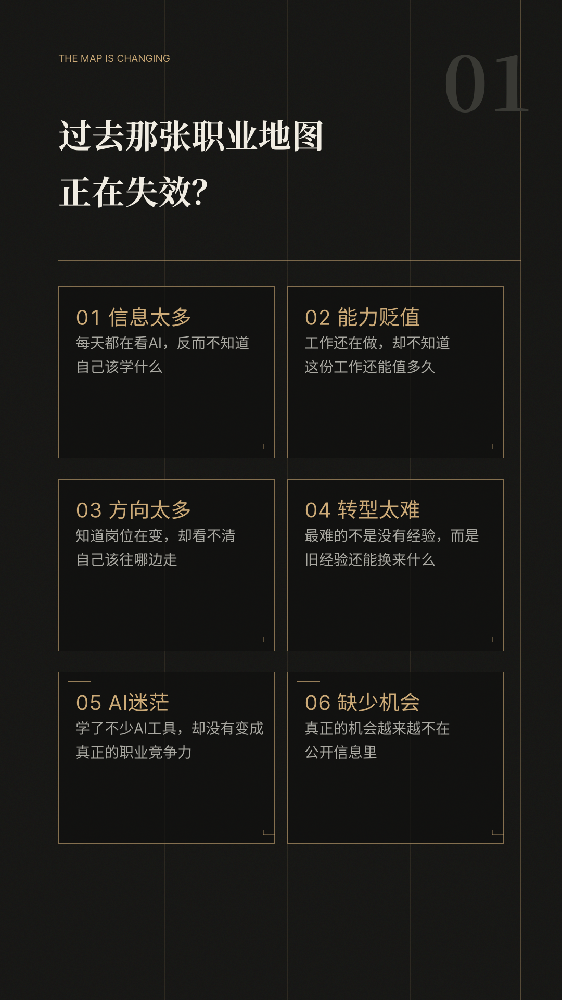
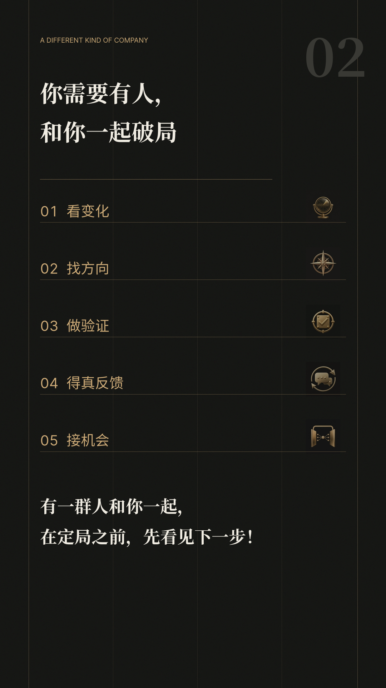
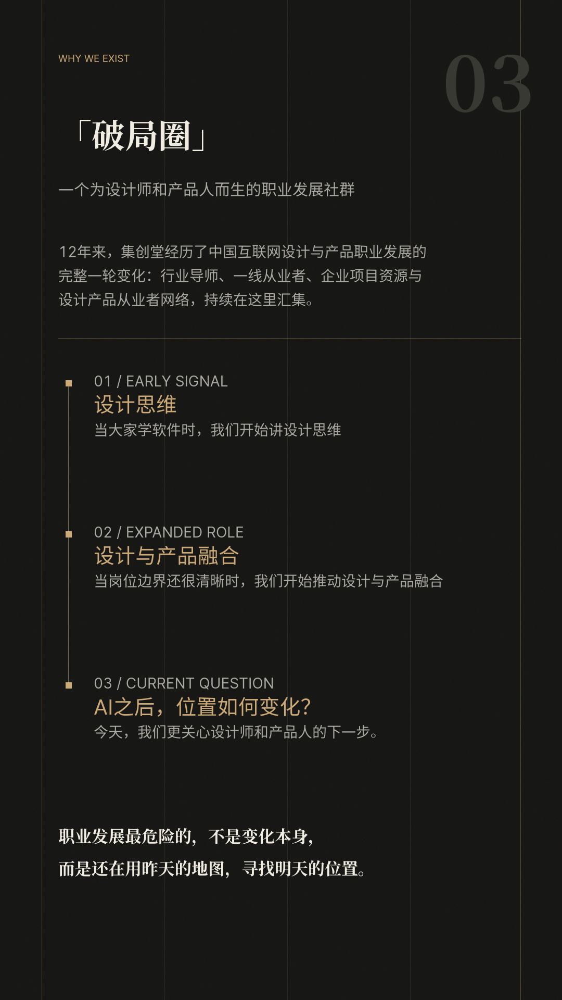

# Yinxi Black Gold Longform

面向课程、活动、研究、权益与专业内容的中文黑金手机长图 Skill。它把长文案和真实素材先转成待确认的营销方案，再生成一份可编辑、自包含的 HTML 海报母版，并由同一浏览器导出正式 PNG。

<p align="center">
  
</p>

## 案例

<p align="center">
  
  
  
  
</p>

## 它适合什么

- 课程介绍、线下活动、训练营与权益说明
- 研究、职业发展、专业服务与内容型宣传海报
- 已有中文长文案、人物照片、二维码、品牌素材或可验证事实的移动端长图

不用于多主题视觉探索、纯网页交付，或需要用图像模型生成准确中文信息的任务。

## 它如何工作

```text
原始文案与素材
↓
内容分析 + 事实锁定
↓
营销提炼 + 用户确认
↓
文案确认时一并收集可选导师/嘉宾人像与报名二维码
↓
默认主题主视觉 + R 配方 + 连续阅读区 + L 契约
↓
render.html（案例编辑源）
↓
poster.html（图片与字体内嵌的正式母版）
↓
同一 Chromium 导出 final.png
↓
规则检查与人工复核
```

首帧是无章节号封面：只保留一个活动/项目语境眉题，主标题给出核心主张，副标题只补充新信息。默认使用从中下部满幅融入母版的主题暗场主视觉；导师/嘉宾人像用于中段，只有用户明确要求时才作为首帧。解释正文用 Regular，日期、价格、行动和关键数据保持 Medium 或更高。

## 正式交付

```text
plan.md             内容、事实锁定、确认记录与验收记录
poster.html         自包含、可编辑的正式海报母版
final.png           由 poster.html 导出的 1080px 宽发布图
```

`poster.html` 内嵌主视觉、人像、二维码、CSS 图片资源和三套正式字体（Serif Bold、Sans Regular、Sans Medium）。因此它可被后续编辑器读取，不依赖案例文件夹、外部图片 URL 或用户本机字体。文件会较大，这是为了换环境后仍保持同一排版。

`frames/` 如出现，仅是从 `final.png` 裁出的诊断图，不参与拼接或生产。文字由字号、换行、溢出与碰撞规则验收，不设置主观手机比例检查。

## 安装

```bash
git clone https://github.com/lifafa0616/yinxi-black-gold-longform.git \
  ~/.codex/skills/yinxi-black-gold-longform
```

安装后新开一个 Codex 会话，提供文案与可用素材，并说明“使用 `yinxi-black-gold-longform` 生成长图”。

## 固定渲染环境

首次使用需要在 Skill 根目录运行：

```bash
python3 -m venv .venv
.venv/bin/python -m pip install -r requirements.txt
.venv/bin/playwright install chromium
```

随后按 [SKILL.md](SKILL.md) 的四条命令：先打包 `poster.html`，由 Chromium 实测生成 Layout Manifest，再渲染 `final.png`，最后校验。Manifest 会绑定当前 HTML；改动 HTML 后必须重新测量和导出。

## 能力与复核边界

- **文字准确性**：原文和事实锁定项可追溯；确认后的展示文字以 HTML 后置渲染。这是 Skill 最确定的能力。
- **排版执行**：字体、图片和连续画布由同一份 `poster.html` 和浏览器渲染；浏览器实际测量文字行、溢出、容器边界、主视觉位置、CTA 数据组与背景采样，校验器拒绝手填或来自另一份 HTML 的检查数据。
- **视觉判断**：主视觉是否真正融入母版、封面信息是否语义重复、金色关键词是否准确取自原文，仍需人查看局部资产、Plan 与最终图。
- **人像精修**：Skill 选择透明、蒙版或裁切模式并建立基本图文关系；发丝级抠图与多人像像素级微调留给后续编辑工具。

案例图仅用于说明本 Skill 的视觉基线与版式能力；请勿将其中的原始文案、人物或品牌信息视为新项目素材。
